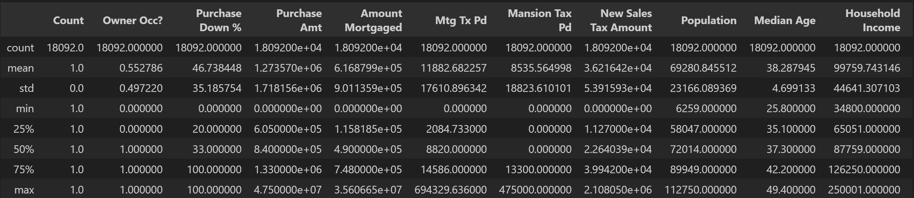
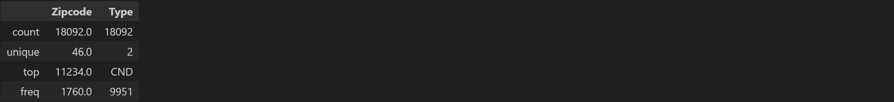
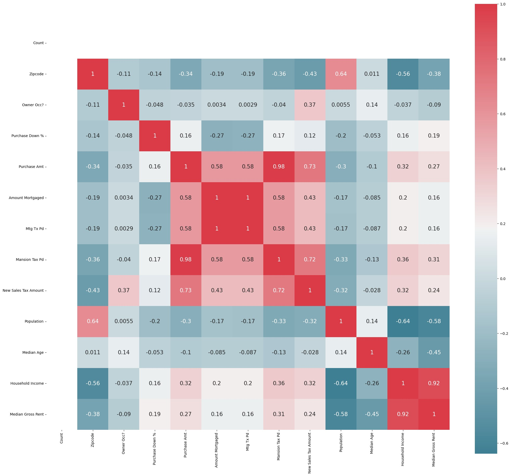
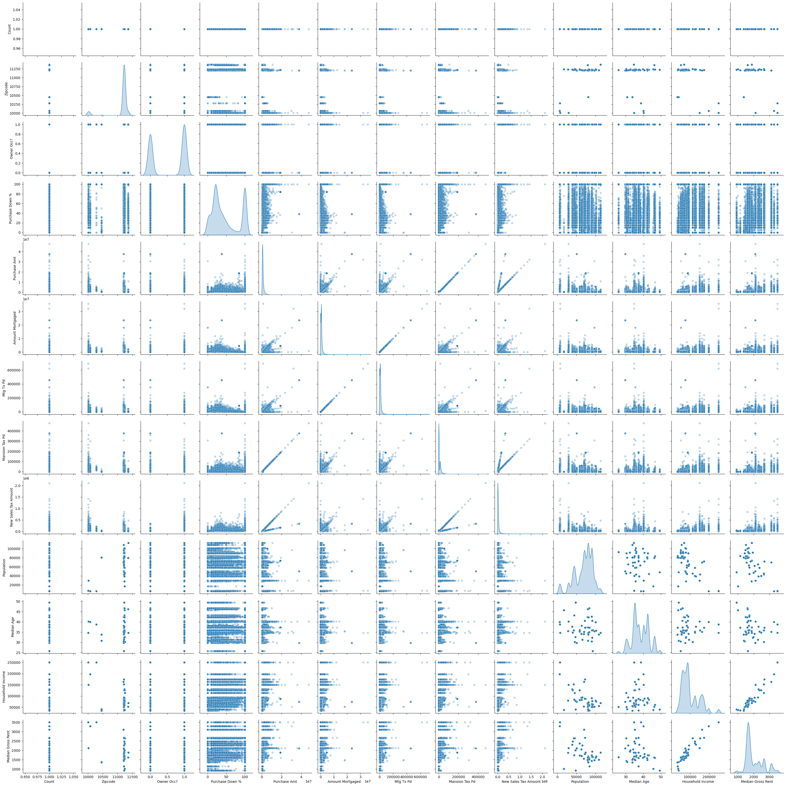

# **Mortgage Tax Study**

__Students:__ Andrea Ceriati, Sarah Demmon, Kat McEldowney, Chantal Thomas 

__Instructor:__ Daniel Pulido-Mendez

__Institution:__ Columbia Engineering

__Course:__ Data Analytics Boot Camp

__Assignment:__ Python Project

__Date:__ 12/18/2023

---

## Table of Contents


   [**Introduction**](#Intro1)

   [**Importing Libraries**](#IL)

1. [**Data Import, Cleaning & Wrangling**](#DWrang)

    1.1 [**Importing Census Data**](#CensusD)
    
    1.2 [**Importing Tax Data**](#TaxD)

    1.3 [**Merge the Data**](#DataD)

    1.4 [**Handling Missing Data**](#MissD)

    1.5 [**Checking and Correcting Data Format**](#FormD)

2. [**Exploratory Data Analysis**](#EDA)

    2.1 [**Descriptive Statistics**](#DS)

    2.2 [**Correlation**](#Corr)

    2.3 [**Data Visualization**](#DV)

3. [**Conclusions**](#Concl)

## Introduction

New York imposes a mortgage tax on real estate transactions. In NYC, the tax rates are 1.8% for mortgages under $500,000 and 1.95% for mortgages over $500,000. No sales tax is applied when buying a home, but the mortgage amount is taxed. Sales tax (1%) is only applied to homes over $1,000,000.

- A $500,000 cash purchase incurs no tax.
- A 20% down payment ($400,000 mortgage) results in $7,200 in mortgage tax.
- A 3% down payment requires an additional $8,730 in closing costs.

**Project Hypotheses**

1. Impact on Economically Disadvantaged:

- Explore how this policy disproportionately affects economically disadvantaged individuals.

2. Revenue Impact of Tax Adjustment:

- Assess the potential revenue increase if the tax is based on the sales price, not the mortgage amount.

- Consider a lower, uniform sales tax rate and a reduced Mansion tax for homes over a million dollars.

**Data Analysis Plan:**

- Analyze sales data of 15,550 Brooklyn homes sold in 2022.
- Calculate current mortgage tax revenue.
- Project revenue under a 2/3 reduced sales tax rate.
- Assess impact of a 0.5% Mansion tax for high-value homes.

**Demographic Examination**

- Use census data to compare demographics across different zip codes.
- Explore whether lower-income individuals contribute a larger share of this tax compared to higher-income areas.

---

New York imposes a mortgage tax on real estate transactions. This tax rate in NYC is 1.8% on mortgage amounts less than $500,000 and 1.95% on mortgages over $500,000. When buying a home, there is no sales tax, you are only taxed on the mortgage amount. Thre is a mansion Tax of 1% on homes over $1,000,000.

This means that a person buying a $500,000 home for cash pays no tax, a person buying the same home and putting 20% down, (or borrowing $400,000) pays $7,200 in mortgage tax, and a person who only has a 3% down payment on the same purchase must pay $8,730 in additional closing costs to cover this tax.

Upon examining the NY.gov page regarding sales tax collection (https://www.tax.ny.gov/data/stats/taxfacts/sales-miscellaneous-taxes.htm) it was discovered that "New York State offers tax exemptions on food, clothing, residential energy, Internet charges, and cable television, as well as a motor fuel tax cap.' It could be inferred that the reason for the lack of a sales tax on Real Estate puchases is becuase the government sees a home purchase as a necessary purchase that should be untaxed. If this is the case, why are mortgges taxed? Any why aren't purchases of investment properties taxed?
Real Estate is the only industry that we can think of where you can purchase corporate assets and not pay tax on that purchase. A real estate investor who purchases buildings for cash, does not pay any sales tax on this transaction. The US government is attempting to limit corporate control of single family homes with the pending legislation *End Hedge Fund Control of American Homes Act of 2023* that will require any entity with a net value including help assets of over $50 billion to sell off the single family homes they currently own over the next ten years, and prohibit them from aquiring new single family homes. This is an effort to increase the avaialbily of single family homes for individual buyers. There is anohter piece of legislation proposed that would charge a $10,000 per home annual fee for investors owning over 75 homes. (https://www.nytimes.com/2023/12/06/realestate/wall-street-housing-market.html) (https://www.businessinsider.com/housing-market-affordability-investors-hedge-funds-wall-street-democrats-bill-2023-12). In light of this, the ability to purchase a single family home as an invetment without paying sales tax seems like a big oversight. We propose, to assist in this goal of promoting individual ownership of single family homes and apartments, a sales tax of 50% of the current sales tax in NYC, be levied on purchases of single family homes by investors.

We have two hypotheses that we will explore in this project: 
•	We believe that the mMrtgage Tax is a policy that has a disparate impact on people who are already economically disadvantaged. 
•	We also believe that if this tax was lowered and applied across the board to all home purchases, with a higher tax rate applied to investment propery purchases, based on sales price not mortgage amount, the policy would not only be more equitable, but also raise more revenue for the government.

We analyzed the sales data of 15,550 homes sold in Brooklyn, NY in 2022, as well as 2,164 homes sold in 2022 of four of the highest income zip codes and the four lowest income zipcodes in the other boroughs. We used this data to calculate how much mortgage tax was raised and how much would be raised if it were instead a sales tax that was only 1/2 of the current mortgage tax rate and 1/2 the current mansion tax rate on purchases of a proimary residence, and 1/2 the current sales tax rate on investment property purchases. 
We also used census data to examine the differences in demographics of the different zip codes to see if people with lower incomes are paying a larger portion of this tax than people living in zip codes with higher average incomes.

The property sales data came from Property Radar (https://app.propertyradar.com/). We filtered the search to only included sales of condos and single family homes that closed in the 2022 calendar year and market sales that were listed on the open market. This means that the sample does not include short sales, forclosures, or arms length transactions (such as a preson selling to a family member or friend without first listing the home on the open market).

---

## Importing Libraries

```Python
import pandas as pd
import numpy as np
import requests
from census import Census
import matplotlib.pyplot as plt
import seaborn as sns
from scipy import stats
import json
import plotly.express as px
from urllib.request import urlopen

import warnings
warnings.filterwarnings("ignore")
```

## 1. Data Cleaning & Wrangling <a name="DWrang"></a>

The dataset was obtained from the United States Census Bureau. To access the data, an API call was initiated. The dataset provides information on population, median age, household income, median gross rent, categorized by zipcode, for the year 2022.
The selected zip codes encompassed all of Brooklyn, including the four wealthiest and poorest zip codes in New York.

Information about the data and its variables can be found at links below:

* Review the following page to learn more about the Census API: <https://www.census.gov/programs-surveys/acs/technical-documentation/table-and-geography-changes/2022/5-year.html>

* Review the following page to learn more about the 2022 data labels: <https://api.census.gov/data/2022/acs/acs5/variables.html>

### 1.2 Importing Tax Data <a name="TaxD"></a>

The property sales data was downloaded from Property Radar. The data was filtered to only included sales of condos and single family homes that closed in the 2022 calendar year and market sales that were listed on the open market. This means that the sample does not include short sales, forclosures, or arms length transactions (such as a preson selling to a family member or friend without first listing the home on the open market).
The dataset includes salses data of 15,550 homes sold in Brooklyn , NY in 2022, as well as 2,164 homes sold in 2022 of four of the highest income zip codes and the four lowest income zipcodes in the other boroughs.

### 1.3 Merge the Data <a name="DataD"></a>

The two datasets were merged on Zipcode to form a unified dataframe for the final analysis.

The size of the data frame is: 18150, 14.

### 1.4 Handling Missing Data <a name="MissD"></a>

The dataset was carefully examined to identify any missing data. During the analysis, it was noted that there were entries displaying a zipcode of 0, which is not valid for Brooklyn. Additionally, there was a zipcode, 11243, representing just one block in Brooklyn, for which no census data was available. This discovery is intriguing and necessitates further investigation.

### 1.5 Checking and Correcting Data Format <a name="FormD"></a>

## 2. Exploratory Data Analysis <a name="EDA"></a>

Summary statistics for the dataset were printed.

Knowing the summary statistics for the whole dataset gave a lot of information about each variable and set the basis for a good exploratory analysis.

<p align='center'> </p>

Looking at the summary statistics above it was possible to obtain information as the mean, median, standar deviation, min, max, percentiles, of the variables.

<p align='center'> </p>

Summary statistics for object values provided information on the number of unique values in each category and which one is more frequent.
From the table above it could be noticed that the zip code with more sales was 11234, with a frequenxy of 1760. Also, the most common house type is condominium, with a frequency of 9951.

### 2.2 Correlation <a name="Corr"></a>

Since there were a lot of variables to take into account, correlation helped predict whether some variables had some predictive power over other variables. The correlation coefficient is a statistic that measures the degree to which a variable is a function of some other variable. This value ranges from -1 to 1.

The correlation coefficient between all the variables was calculated to gain a better understanding of which variables were dependent of which other ones.

<p align='center'> </p>

### 2.3 Data Visualization <a name="DV"></a>

To gain a better understanding of the correlations, the following code was utilized to create scatter plots between all the variables.
This allowed to better visualize which variables were related and and which relationship could have analyzed more closely.

<p align='center'> </p>

## 3. Conclusions <a name="Concl"></a>