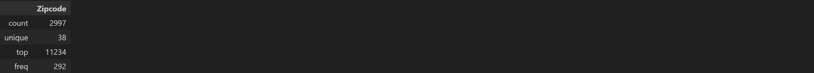

# **Mortgage Tax Study**

__Students:__ Andrea Ceriati, Sarah Demmon, Kat McEldowney, Chantal Thomas 

__Instructor:__ Daniel Pulido-Mendez

__Institution:__ Columbia Engineering

__Course:__ Data Analytics Boot Camp

__Assignment:__ Python Project

__Date:__ 12/18/2023

---

## Table of Contents


   [**Introduction**](#Intro1)

   [**Importing Libraries**](#IL)

1. [**Data Import, Cleaning & Wrangling**](#DWrang)

    1.1 [**Importing Census Data**](#CensusD)
    
    1.2 [**Importing Tax Data**](#TaxD)

    1.3 [**Merge the Data**](#DataD)

    1.4 [**Handling Missing Data**](#MissD)

    1.5 [**Checking and Correcting Data Format**](#FormD)

2. [**Exploratory Data Analysis**](#EDA)

    2.1 [**Descriptive Statistics**](#DS)

    2.2 [**Correlation**](#Corr)

    2.3 [**Data Visualization**](#DV)

3. [**Conclusions**](#Concl)

## Introduction

New York imposes a mortgage tax on real estate transactions. This tax rate in NYC is 1.8% on mortgage amounts less than $500,000 and 1.95% on mortgages over $500,000. When buying a home, there is no sales tax, you are only taxed on the mortgage amount. Thre is a mansion Tax of 1% on homes over $1,000,000.

This means that a person buying a $500,000 home for cash pays no tax, a person buying the same home and putting 20% down, (or borrowing $400,000) pays $7,200 in mortgage tax, and a person who only has a 3% down payment on the same purchase must pay $8,730 in additional closing costs to cover this tax.

Upon examining the NY.gov page regarding sales tax collection (https://www.tax.ny.gov/data/stats/taxfacts/sales-miscellaneous-taxes.htm) it was discovered that "New York State offers tax exemptions on food, clothing, residential energy, Internet charges, and cable television, as well as a motor fuel tax cap.' It could be inferred that the reason for the lack of a sales tax on Real Estate puchases is becuase the government sees a home purchase as a necessary purchase that should be untaxed. If this is the case, why are mortgges taxed? Any why aren't purchases of investment properties taxed?
Real Estate is the only industry that we can think of where you can purchase corporate assets and not pay tax on that purchase. A real estate investor who purchases buildings for cash, does not pay any sales tax on this transaction. The US government is attempting to limit corporate control of single family homes with the pending legislation *End Hedge Fund Control of American Homes Act of 2023* that will require any entity with a net value including help assets of over $50 billion to sell off the single family homes they currently own over the next ten years, and prohibit them from aquiring new single family homes. This is an effort to increase the avaialbily of single family homes for individual buyers. There is anohter piece of legislation proposed that would charge a $10,000 per home annual fee for investors owning over 75 homes. (https://www.nytimes.com/2023/12/06/realestate/wall-street-housing-market.html) (https://www.businessinsider.com/housing-market-affordability-investors-hedge-funds-wall-street-democrats-bill-2023-12). In light of this, the ability to purchase a single family home as an invetment without paying sales tax seems like a big oversight. We propose, to assist in this goal of promoting individual ownership of single family homes and apartments, a sales tax of 50% of the current sales tax in NYC, be levied on purchases of single family homes by investors.

We have two hypotheses that we will explore in this project: 
•	We believe that the mortgage already economically disadvantaged. 
•	We also believe that if this tax was lowered and applied across the board to all home purchases, with a higher tax rate applied to investment propery purchases, based on sales price not mortgage amount, the policy would not only be more equitable, but also raise more revenue for the government.

We analyzed the sales data of 3012 homes sold in Brooklyn, NY in 2022. We used this data to calculate how much mortgage tax was raised and how much would be raised if it were instead a sales tax that was only 1/2 of the current mortgage tax rate and 1/2 the current mansion tax rate on purchases of a proimary residence, and 1/2 the current sales tax rate on investment property purchases. 
We also used census data to examine the differences in demographics of the different zip codes to see if people with lower incomes are paying a larger portion of this tax than people living in zip codes with higher average incomes.

The property sales data came from Property Radar (https://app.propertyradar.com/). We filtered the search to only included sales of condos and single family homes that closed in the 2022 calendar year and market sales that were listed on the open market. This means that the sample does not include short sales, forclosures, or arms length transactions (such as a preson selling to a family member or friend without first listing the home on the open market).

## Importing Libraries

```Python
import pandas as pd
import numpy as np
import requests
from census import Census
import matplotlib.pyplot as plt
import seaborn as sns
from scipy import stats
import json
import plotly.express as px
from urllib.request import urlopen

import warnings
warnings.filterwarnings("ignore")
```

## 1. Data Cleaning & Wrangling <a name="DWrang"></a>

The dataset was obtained from the United States Census Bureau. To access the data, an API call was initiated. The dataset provides information on population, median age, household income, median gross rent, categorized by zipcode, for the year 2022.
The selected zip codes encompassed all of Brooklyn.

Information about the data and its variables can be found at links below:

* Review the following page to learn more about the Census API: <https://www.census.gov/programs-surveys/acs/technical-documentation/table-and-geography-changes/2022/5-year.html>

* Review the following page to learn more about the 2022 data labels: <https://api.census.gov/data/2022/acs/acs5/variables.html>

<p align='center'> </p>

### 1.2 Importing Tax Data <a name="TaxD"></a>

The property sales data was downloaded from Property Radar. The data was filtered to only included sales of condos and single family homes that closed in the 2022 calendar year and market sales that were listed on the open market. This means that the sample does not include short sales, forclosures, or arms length transactions (such as a preson selling to a family member or friend without first listing the home on the open market).
The dataset includes salses data of 3012 homes sold in Brooklyn, NY in 2022.

<p align='center'> </p>

### 1.3 Merge the Data <a name="DataD"></a>

The two datasets were merged on Zipcode to form a unified dataframe for the final analysis.

The size of the data frame is: 3012, 13.

<p align='center'> </p>

### 1.4 Handling Missing Data <a name="MissD"></a>

The dataset was carefully examined to identify any missing data. During the analysis, it was noted that there were entries displaying a zipcode of 0, which is not valid for Brooklyn. Additionally, there was a zipcode, 11243, representing just one block in Brooklyn, for which no census data was available. This discovery is intriguing and necessitates further investigation.

### 1.5 Checking and Correcting Data Format <a name="FormD"></a>

The data format was checked and corrected to ensure data consistency.

## 2. Exploratory Data Analysis <a name="EDA"></a>

Summary statistics for the dataset were printed.

Knowing the summary statistics for the whole dataset gave a lot of information about each variable and set the basis for a good exploratory analysis.

<p align='center'> </p>

Looking at the summary statistics above it was possible to obtain information as the mean, median, standar deviation, min, max, percentiles, of the variables.

<p align='center'> </p>

Summary statistics for object values provided information on the number of unique values in each category and which one is more frequent.
From the table above it could be noticed that the zip code with more sales was 11234, with a frequency of 292.
### 2.2 Correlation <a name="Corr"></a>

Since there were a lot of variables to take into account, correlation helped predict whether some variables had some predictive power over other variables. The correlation coefficient is a statistic that measures the degree to which a variable is a function of some other variable. This value ranges from -1 to 1.

The correlation coefficient between all the variables was calculated to gain a better understanding of which variables were dependent of which other ones.

<p align='center'> </p>

### 2.3 Data Visualization <a name="DV"></a>

A map that shows the Houshold Income in the considered zipcodes was created.

<p align='center'> </p>

This series of scatter plots and box charts shows the relationship between the Median Household Income and Purchase Amt, Mtg Tx Pd, Mtg tax as % Household Income, Months rent spent on Mtg tax, and the New Sales Tax Amount. Pearson's correlation can be found at the top of each chart.

<p align='center'> </p>

In our pie chart, we showed the revenue generated under the current tax system as a proportion of the new tax regime revenue. To break down the chart, the whole pie shows how much revenue is generated under our proposed tax system. The green slice represents the opportunity cost of staying with the current tax system. The blue and red slice is the tax revenue we currently generate which is only ~66% of what we could generate in our proposed sales tax system.

<p align='center'> </p>

Our objective was to demonstrate the comparison of revenue generated under the current tax regime and our proposed system. Our goal was to determine how this system could be advantageous to the state, as well as how it would impact residential home buyers versus investment property owners. The first step was to stratify the Brooklyn data frame into occupied homes and non-occupied homes. Then we were tasked with finding the total tax paid by occupants and investors under the current and new tax systems. We separately calculated the total mortgage tax paid and mansion tax paid by occupants and investors to get the total tax revenue generated. For the new revenue, we calculated the total new sales tax paid by occupants and investors to determine the new revenue generation. After plotting our data as a bar chart, we can see that occupants would pay approximately $10,000,000 less under our proposed tax system, while investors would have to pay approximately $40,000,000 more. This aligns with our objective to tax investment property owners more because today they enjoy many tax benefits, while homeowners bear a heavier burden.

<p align='center'> </p>

The data was employed to compute the total mortgage tax generated and to project the potential revenue under an alternative scenario involving a sales tax. In this hypothetical scenario, the sales tax was considered at half of the current mortgage tax rate, half of the existing mansion tax rate for primary residence purchases, and half of the prevailing sales tax rate for investment property acquisitions.

The total mortgage tax paid in Brooklyn by individuals purchasing primary residences in 2022 was $20,431,958 and the total mansion tax collected was $14,760,917.
The combined mortgage and mansion tax was 35,192,875, our hypothetical sales tax would have raised $21,902,851
The total mortgage tax paid in Brooklyn by investors in 2022 was $16,638,799 and the total mansion tax collected was $9,044,858.
The combined mortgage and mansion tax was 25,683,657, our hypothetical sales tax on investments would have raised $70,280,519
The total tax raised in 2022 was 60,876,531 and the total amount that would have been raised would have been $92,183,370

## 3. Conclusions <a name="Concl"></a>

We found upon cleaning our data that our data set was flawed and not as extensive as we initially thought. If we had more time, we believe we might have been able to track down a primary source of data instead of relying on the secondary source that we obtained.
We also, if given more time, would have liked to expand the data to instead be comprised of a random samples of zips codes in all five boroughs and to span different years. The exploration of the data we did procure uncovered information previously unconsidered and lead us to desire further exploration.
Mortgage rates change from year to year and upon examining historical interest rates, we realize that 2022 was far from a typical year. In 2010 the prime rate dropped to 3.25, the lowest it had been in 55 years.  It went up and back down and was again 3.25% in Marck of 2020 where it stayed until March of 2022. Over the course of 2022 the rate continued to climb, reaching 7.5% by the end of 2022. This has a big impact on the types of sales that were completed over the course of that year as the higher interest rates changes individuals ability to qualify for higher purchase amounts.
Another problem with the data is we were not able to obtain a primary data source of the household income for the specific transactions that we studies, we instead relied on the census data for median household income. This data is aggregated by zip and the highest med household income is $173,899 and the biggest purchase amount in the study was $30,563,714. We believe there are many households in Brooklyn with far above $173,899 household income, and no household with that amount of income is purchasing property for over $30 million.

In conclusion, our findings suggest that the new tax system is more equitable because it redistributes the tax burden, alleviating the financial load on residential home buyers while ensuring  that investors contribute a more substantial share. The bar chart analysis involves a comparison of revenue generation between the two systems. Occupants would pay approximately $10,000,000 less under the proposed tax system, while investors would bear an additional cost of around $40,000,000. This stark contrast aligns with the objective of the new tax system to tax investment property owners more, aiming to address the perceived imbalance in tax benefits. In addition, our proposed tax system is more advantageous for the state from a revenue generation standpoint. The opportunity cost of maintaining the current tax system underscores the potential gains and fairness associated with transitioning to the proposed system. This inference is evident through the pie chart we created. The breakdown of revenue in the pie chart indicates that under the current tax system, only approximately 66% of the potential revenue is generated compared to the proposed sales tax system. This highlights an opportunity cost associated with sticking to the existing tax regime.